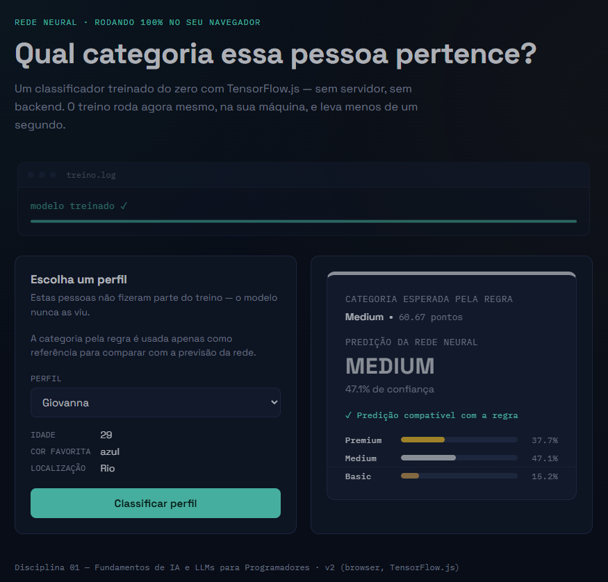

# Primeira Rede Neural — v2 Web

> Classificador de perfis executado 100% no navegador com TensorFlow.js.

[](https://rede-neural-v2.vercel.app/)

## Sobre o projeto

Aplicação de classificação supervisionada desenvolvida com JavaScript e TensorFlow.js, capaz de classificar perfis em `Premium`, `Medium` ou `Basic` a partir de idade, cor favorita e localização.

O projeto foi desenvolvido como evolução do primeiro experimento [`v1-console`](./v1-console/), passando de uma implementação executada no console para uma aplicação web completa, com dataset sintético, pré-processamento, treinamento, teste, avaliação e inferência no navegador.

O objetivo não foi criar um sistema de produção, mas construir uma aplicação pequena o suficiente para compreender, na prática, o ciclo completo de um problema de classificação supervisionada.

### Resultado principal

**80% de acurácia no conjunto de teste**, utilizando 90 registros de treinamento e os mesmos 30 registros de teste nos experimentos.

## Destaques

- Treinamento e inferência executados diretamente no navegador
- TensorFlow.js sem backend ou servidor de processamento
- Dataset sintético gerado por regra determinística
- Normalização e one-hot encoding
- Separação entre dados de treinamento e teste
- Avaliação com acurácia, análise de erros e matriz de confusão
- Experimentos com 30, 60 e 90 registros de treinamento
- Arquitetura modular em JavaScript
- Interface interativa para demonstração das previsões

## Objetivo

Construir e avaliar uma rede neural capaz de classificar perfis em três categorias — `Premium`, `Medium` e `Basic` — a partir de três atributos:

- idade;
- cor favorita;
- localização.

Além da implementação do modelo, o projeto busca investigar como a quantidade e a distribuição dos dados influenciam a capacidade de generalização.

## Interface



Após o treinamento, a aplicação disponibiliza alguns perfis que não fazem parte do conjunto de treinamento.

O usuário pode selecionar um perfil e visualizar:

- os dados utilizados na previsão;
- a categoria esperada pela regra sintética;
- a pontuação calculada pela regra;
- a categoria prevista pela rede neural;
- o nível de confiança da previsão;
- as probabilidades atribuídas às três categorias.

A interface também indica quando a previsão da rede coincide ou diverge da categoria definida pela regra.

## Tecnologias


## Evolução do projeto

### Mudança mais importante em relação ao v1-console

No primeiro projeto, o dataset era extremamente pequeno e os exemplos ficavam diretamente no código.

O `v1-console` tinha, essencialmente, este fluxo:

```text
dados definidos no JavaScript
   ↓
vetorização
   ↓
treinamento
   ↓
predição pelo console
```

No `v2-web`, a curiosidade de levar o modelo para o navegador transformou o experimento em uma aplicação mais completa:

```text
Dataset CSV
   ↓
Carregamento dos dados
   ↓
Aplicação da regra de classificação
   ↓
Validação
   ↓
Seleção dos dados de treinamento
   ↓
Pré-processamento
   ↓
Treinamento da rede neural
   ↓
Avaliação no conjunto de teste
   ↓
Análise dos erros
   ↓
Interface de inferência no navegador
```

Essa mudança foi importante porque o foco deixou de ser apenas **"fazer a rede neural funcionar"** e passou a ser também **"entender como avaliar o comportamento da rede neural"**.

Além de executar a rede no browser, a nova versão introduziu uma preocupação maior com qualidade dos dados, separação entre treino e teste, avaliação e análise dos erros.

## Dados e regra de classificação

O dataset é sintético e os rótulos são derivados deterministicamente de uma regra de pontuação criada para o experimento.

Cada pessoa recebe pontos de acordo com três características.

### Idade

A idade utilizada no projeto está entre 25 e 40 anos e contribui de forma linear para a pontuação.

Quanto maior a idade dentro desse intervalo, maior a quantidade de pontos.

### Cor favorita

```text
Azul     → 30 pontos
Vermelho → 20 pontos
Verde    → 10 pontos
```

### Localização

```text
São Paulo → 30 pontos
Rio       → 20 pontos
Curitiba  → 10 pontos
```

### Pontuação final

```text
pontuação = pontos da idade
          + pontos da cor
          + pontos da localização
```

### Categorias

```text
Premium → pontuação >= 68
Medium  → pontuação >= 52 e < 68
Basic   → pontuação < 52
```

A escolha dessas faixas foi feita de modo a produzir uma distribuição aproximadamente equilibrada entre as três classes considerando as combinações possíveis do problema.

> **Importante:** essa regra é uma fonte sintética de rótulos para o experimento. Ela não representa um modelo real de classificação de pessoas nem uma relação estatística validada no mundo real.

## Pré-processamento

A rede neural não recebe diretamente valores como `"azul"` ou `"São Paulo"`. Antes do treinamento, os dados são transformados em números.

### Normalização da idade

A idade é normalizada para uma faixa entre `0` e `1`.

```text
idade normalizada = (idade - idadeMin) / (idadeMax - idadeMin)
```

### One-hot encoding

As variáveis categóricas são representadas por posições binárias.

A entrada da rede possui 7 posições:

```text
[idade_normalizada,
 azul,
 vermelho,
 verde,
 São Paulo,
 Rio,
 Curitiba]
```

Exemplo:
```text
[0.20, 0, 0, 1, 0, 0, 1]
```

representa uma pessoa com idade normalizada de `0.20`, cor `verde` e localização `Curitiba`.

## Modelo

### Arquitetura da rede

A arquitetura foi mantida próxima da utilizada no `v1-console` para que a evolução entre os projetos pudesse ser observada principalmente pela estrutura do experimento e pela forma de utilização do modelo.

```text
Entrada: 7 features
        ↓
Dense: 80 neurônios + ReLU
        ↓
Dense: 3 neurônios + Softmax
        ↓
Premium / Medium / Basic
```

### Configuração de treinamento

| Parâmetro | Valor |
|---|---|
| Optimizer | Adam |
| Função de perda | categoricalCrossentropy
| Métrica | Accuracy |
| Épocas | 100 |
| Shuffle | true 

A saída utiliza `softmax`, produzindo uma probabilidade para cada uma das três categorias.

## Organização do código

O projeto foi organizado em módulos para separar responsabilidades.

De forma geral:

```text
v2-web/
├── data/
│   ├── dataset_teste.csv
│   └── dataset_treinamento.csv
│
├── js/
│   ├── avaliacao.js
│   ├── config.js
│   ├── dataset.js
│   ├── modelo.js
│   ├── preprocessamento.js
│   ├── regras.js
│   ├── ui.js
│   └── validacao.js
│
├── app.js
├── index.html
└── style.css
```

### Responsabilidades

| Arquivo | Responsabilidade |
|---|---|
| `app.js` | orquestração do fluxo da aplicação |
| `config.js` | configurações e parâmetros |
| `dataset.js` | carregamento e seleção dos dados |
| `regras.js` | geração da pontuação e categoria |
| `preprocessamento.js` | normalização e one-hot encoding |
| `modelo.js` | treinamento e inferência |
| `validacao.js` | validação dos datasets |
| `avaliacao.js` | métricas, erros e matriz de confusão |
| `ui.js` | interação e renderização da interface 

## Dataset e separação entre treino e teste

O conjunto de treinamento possui 90 registros e o conjunto de teste possui 30 registros.

O conjunto de teste é fixo e não participa do treinamento. Ele foi separado para que os experimentos pudessem comparar diferentes quantidades de dados de treinamento utilizando exatamente os mesmos exemplos para avaliação.

Uma observação importante sobre a metodologia:

> O conjunto de teste foi selecionado a partir do dataset sintético utilizado no projeto. Portanto, ele funciona como um **holdout fixo para este experimento**, e não como uma base externa ou representativa de dados reais.

## Experimentos

Foram realizados três experimentos, sempre avaliando o modelo sobre os mesmos 30 registros de teste.

| Registros de treinamento | Registros de teste | Acertos | Erros | Acurácia |
|---:|---:|---:|---:|---:|
| 30 | 30 | 11 | 19 | 36,67% |
| 60 | 30 | 19 | 11 | 63,33% |
| 90 | 30 | 24 | 6 | 80,00% |

### Resultado observado

A evolução foi:

```text
30 registros → 36,67%
60 registros → 63,33%
90 registros → 80,00%
```

O aumento da quantidade de dados de treinamento foi acompanhado por uma melhora significativa na capacidade de generalização do modelo.

## Matriz de confusão

### Treinamento com 30 registros

```text
              Predito
Real          Basic  Medium  Premium

Basic            1      9       0
Medium           5      3       2
Premium          0      3       7
```

Nesse cenário, o modelo ainda apresenta grande dificuldade para separar as classes, principalmente `Basic` e `Medium`.

### Treinamento com 60 registros

```text
              Predito
Real          Basic  Medium  Premium

Basic            6      4       0
Medium           3      5       2
Premium          0      2       8
```

Com mais dados, a rede passa a reconhecer melhor as três classes.

### Treinamento com 90 registros

```text
              Predito
Real          Basic  Medium  Premium

Basic            8      2       0
Medium           1      7       2
Premium          0      1       9
```

Nesse cenário, o modelo alcança:

- `Basic`: 8/10 acertos
- `Medium`: 7/10 acertos
- `Premium`: 9/10 acertos

O modelo praticamente elimina a confusão direta entre `Basic` e `Premium`. Os erros restantes ficam concentrados principalmente entre classes vizinhas:

```text
Basic ↔ Medium
Medium ↔ Premium
```

### Análise dos erros

#### Por que Medium foi a classe mais difícil de prever?

A classe `Medium` ocupa a região intermediária entre as duas outras classes:

```text
Basic             Medium              Premium
───────────────|──────────────────|───────────────
               52                 68
```

Por isso, ela possui duas fronteiras de decisão.

Um `Basic` próximo de 52 pode ser confundido com `Medium`.

Um `Premium` próximo de 68 pode ser confundido com `Medium`.

E o próprio `Medium` pode ser confundido para qualquer um dos dois lados.

Isso apareceu nos erros do experimento com 90 registros:

```text
54,67 → Medium classificado como Basic
65,33 → Medium classificado como Premium
66,00 → Medium classificado como Premium
70,00 → Premium classificado como Medium
```

Esses exemplos estão próximos das fronteiras de 52 e 68 pontos.

Isso ajuda a mostrar que, depois que o modelo aprendeu melhor a estrutura geral do problema, os erros restantes passaram a se concentrar principalmente nas regiões de transição entre as classes.

## Representatividade dos dados

Outro comportamento observado durante os experimentos foi a distribuição das localizações nos conjuntos de treinamento.

### 30 registros

```text
São Paulo → 13
Rio       → 6
Curitiba  → 11
```

### 60 registros

```text
São Paulo → 27
Rio       → 13
Curitiba  → 20
```

### 90 registros

```text
São Paulo → 30
Rio       → 30
Curitiba  → 30
```

O Rio ficou sub-representado nos conjuntos de 30 e 60 registros.

Isso pode ter contribuído para a dificuldade do modelo em generalizar essa característica, principalmente no experimento menor. Entretanto, a quantidade de exemplos de uma cidade, isoladamente, não explica todos os erros, já que outras características também influenciam a classificação.

Essa observação trouxe um aprendizado importante:

> **Não basta olhar apenas para o balanceamento da classe-alvo. Também é necessário observar a representatividade das características utilizadas como entrada.**

Ao mesmo tempo, os resultados mostram que mesmo com o dataset completo equilibrado ainda existem erros próximos às fronteiras de decisão. Portanto, os dois fenômenos precisam ser analisados separadamente: **representatividade dos dados** e **ambiguidade das regiões de classificação**.

## Principais aprendizados

### 1. Fazer uma rede neural funcionar é apenas o começo

No `v1-console`, o principal objetivo era compreender o ciclo básico:

```text
dados → treinamento → inferência
```

No `v2-web`, passei a investigar também:

```text
dados → preparação → treinamento → teste → avaliação → análise
```

### 2. Dados de treinamento e dados de teste têm papéis diferentes

Treinar e testar sobre os mesmos exemplos poderia produzir uma impressão enganosa sobre a capacidade do modelo.

Por isso, o conjunto de teste foi mantido separado e utilizado somente depois do treinamento.

### 3. Mais dados fizeram diferença

O experimento mostrou uma evolução de:

```text
36,67% → 63,33% → 80,00%
```

mantendo o mesmo conjunto de 30 exemplos para teste.

### 4. A acurácia não conta toda a história

A matriz de confusão permitiu observar quais classes estavam sendo confundidas e perceber que os erros restantes estavam concentrados principalmente entre categorias vizinhas.

### 5. A natureza dos erros importa

Analisar os registros errados ajudou a perceber que exemplos próximos aos limites das classes eram mais suscetíveis a confusão.

### 6. Balanceamento não significa apenas quantidade de classes

Também é importante observar como as características de entrada estão distribuídas.

## Limitações

Este projeto foi desenvolvido com finalidade educacional e possui limitações importantes:

- dataset sintético e relativamente pequeno;
- regra de classificação criada artificialmente;
- apenas três características de entrada;
- apenas três classes;
- ausência de dados reais;
- ausência de validação cruzada;
- conjunto de teste derivado do mesmo universo sintético do experimento;
- resultados podem variar entre execuções devido à natureza estocástica do treinamento da rede neural.

Por isso, os resultados devem ser interpretados como parte de um experimento de aprendizagem de Machine Learning, e não como evidência de desempenho de um sistema pronto para produção.

## Conclusão

O `v2-web` representa a evolução do meu primeiro contato prático com redes neurais.

O `v1-console` me ajudou a entender **como uma rede neural é estruturada e treinada**.

A partir dele, o `v2-web` surgiu de uma curiosidade simples: **como fazer esse mesmo processo funcionar dentro do browser?**

Essa pergunta acabou levando o projeto para uma investigação maior sobre dados, pré-processamento, treinamento, generalização e avaliação de modelos.

O principal resultado deste projeto não foi apenas alcançar 80% de acurácia, mas compreender na prática que um modelo de Machine Learning precisa ser analisado além da implementação: é necessário entender os dados, separar treinamento e teste, avaliar a generalização e investigar a natureza dos erros.

Este projeto encerra o primeira projeto prático da disciplina e serve como base para os próximos experimentos com IA.